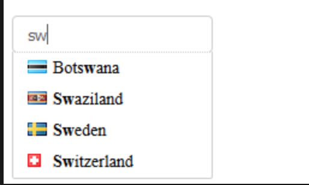

## Тестовые задания для Javascript разработчика

Приветствуем тебя, %username%, ищущий работу!

Что с этим всем делать?
Результат каждого задания - код, который нужно отправить нам, скинув ссылку на repo/gist на Github в наш Телеграм [@iwu_skill_test_bot](http://t.me/iwu_skill_test_bot)

### 1. Задача

Реализовать функцию checkBraces($str), проверяющую на синтаксическую верность последовательность скобок

- Необходимо учитывать вложенность
- Обратите внимание на производительность вашего решения
- В случае ошибки возвращаем 1, в противном случае 0

Минимальный набор тестов:

```
checkBraces("---(++++)----") == 0
checkBraces("") -> 0
checkBraces("before ( middle []) after ") == 0
checkBraces(") (") == 1
checkBraces("} {") == 1
checkBraces("<(   >)") == 1
checkBraces("(  [  <>  ()  ]  <>  )") == 0
checkBraces("   (      [)") == 1
```

### 2. Задача

Реализовать функцию, создающую глубокую копию (deep copy) объекта без использования JSON.stringify

### 3. Рефакторинг

```
function func(s, a, b) {

	if (s.match(/^$/)) {
		return -1;
	}
	
	var i = s.length -1;
	var aIndex =     -1;
	var bIndex =     -1;
	
	while ((aIndex == -1) && (bIndex == -1) && (i > 0)) {
	    if (s.substring(i, i +1) == a) {
	    	aIndex = i;
    	}
	    if (s.substring(i, i +1) == b) {
	    	bIndex = i;
    	}
	    i = i - 1;
	}
	
	if (aIndex != -1) {
	    if (bIndex == -1) {
	        return aIndex;
	    }
	    else {
	        return Math.max(aIndex, bIndex);
	    }
	}
	
	if (bIndex != -1) {
	    return bIndex;
	}
	else {
	    return -1;
	}
}
```
- Как бы вы переписали этот код?

### 4. Практическая задача
Разработать компонент Country Suggest: компонент подсказки названия страны с флагами



- Для тестовой реализации использовать API https://restcountries.eu/#api-endpoints-name
- Компонент должен быть переиспользуемым, то есть не завязанным на конкретный API. Конфигурация должна включать как минимум: 
  - apiURL: string 
  - flagField: string | function(resp) Коллбек позволяет указать их какого поля ответа получать изображение с флагом
- Реализация клавиатурных событий - стрелок вверх-вниз - на ваше усмотрение
- Вы можете использовать свой любимый фрейворк(React, VueJS, etc) или Vanilla JS - на ваше усмотрение
- Проект должен иметь все необходимое для работы в репозитории, включая Readme с документацией по сборке и пример использования


